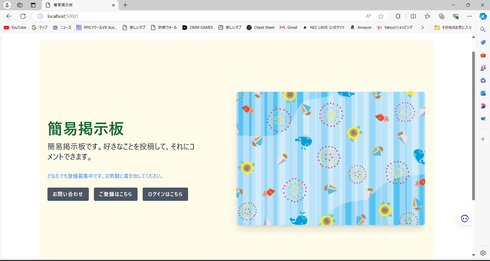
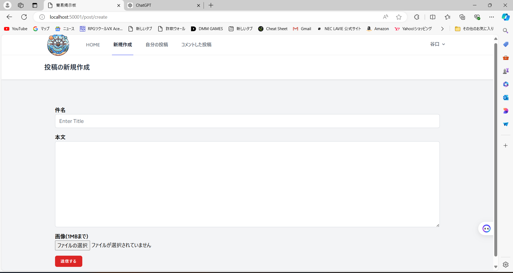
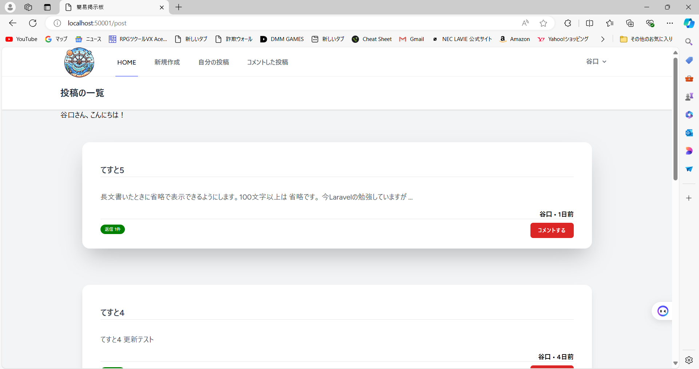
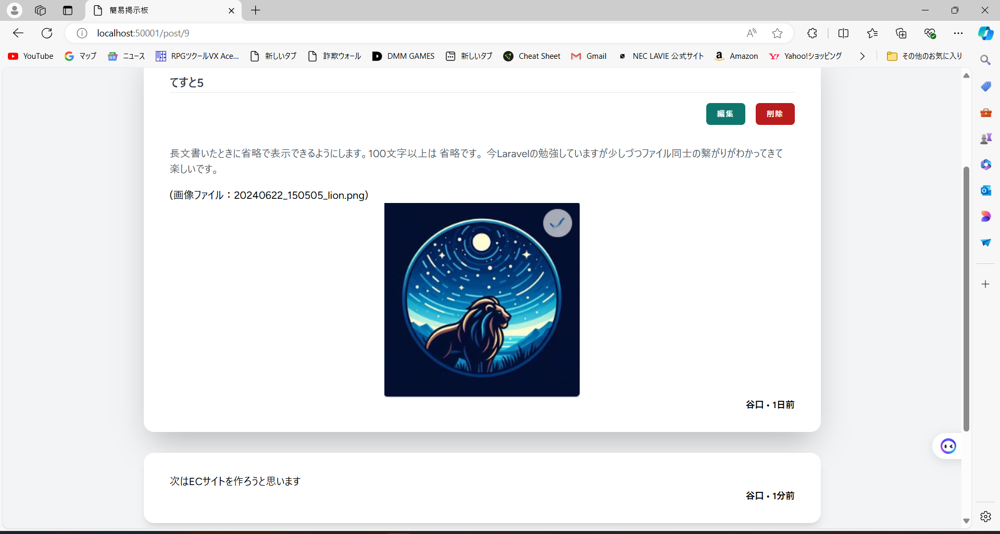
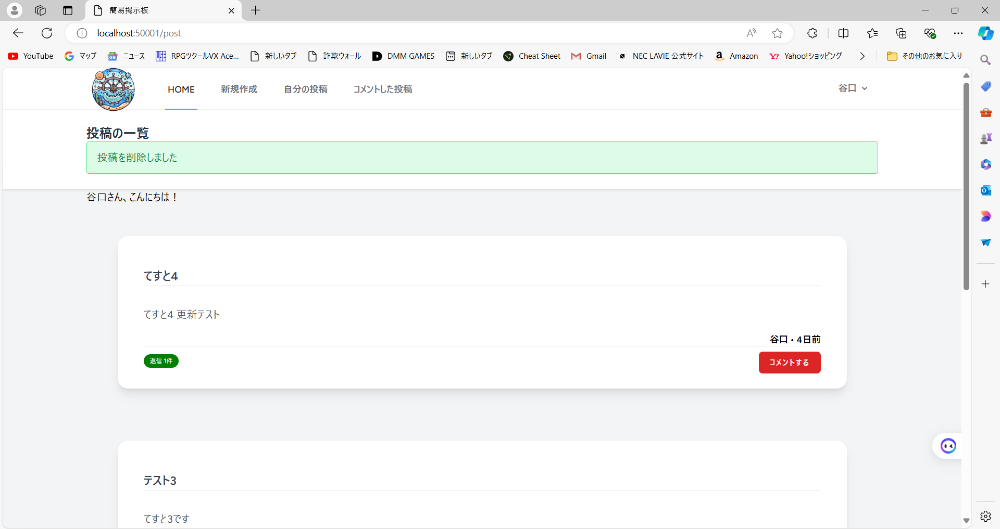
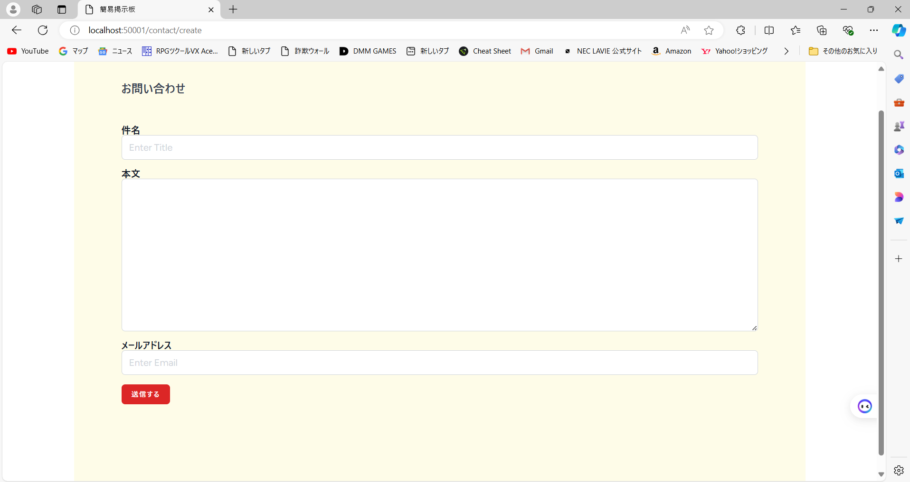

# 簡易掲示板

## 概要
このプロジェクトは、Laravelを使用して作成された簡易掲示板アプリケーションです。ユーザーは掲示板に新しい投稿を作成したり、既存の投稿にコメントを追加したりすることができます。また、問い合わせメール機能も備えています。

## 機能
- 新規投稿の作成
- 投稿の表示
- 投稿へのコメント追加
- 投稿およびコメントの編集
- 投稿およびコメントの削除
- 問い合わせメールの送信

## 使用技術
- Laravel 9.52.16
- PHP 8.2.12
- MySQL 8.0.36
- HTML
- CSS

## アプリケーションの詳細
この簡易掲示板アプリケーションは、ユーザーが自由に投稿を行い、他のユーザーとコミュニケーションを取ることができるシステムです。以下に、アプリケーションの各主要機能について説明します。

### 新規投稿の作成
ユーザーはタイトルと内容を入力して新しい投稿を作成することができます。投稿はリアルタイムで掲示板に表示され、他のユーザーが閲覧できます。

### 投稿の表示
作成された投稿は、掲示板ページにリスト形式で表示されます。各投稿にはタイトル、投稿者、作成日時が含まれています。

### 投稿へのコメント追加
各投稿に対してコメントを追加することができます。ユーザーは自分の意見や感想を自由に投稿することができ、他のユーザーと交流を深めることができます。

### 投稿の削除
ユーザーは自分の投稿の削除をすることができます。これにより、誤った情報や不要な投稿を削除することができます。

### 問い合わせメールの送信
問い合わせフォームを使用して、ユーザーは管理者に直接メールを送信することができます。これにより、質問やフィードバックを迅速に伝えることができます。

## 参考サイト
このアプリケーションは、以下の参考サイトを基に作成されました。
- [Laravelの教科書](https://textpro.addisteria.com/)
